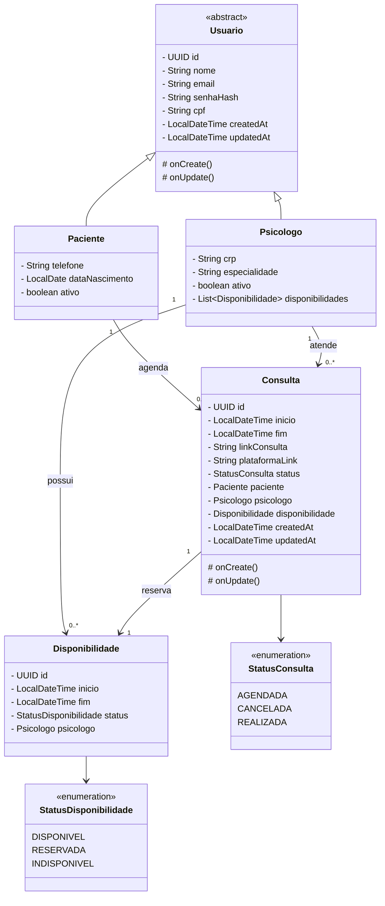

# DignaMente

Aplicação Java com Spring Boot para cadastro de pacientes e psicólogos, gestão de disponibilidades e agendamento de consultas com link de atendimento.

## Tecnologias

- Java 17
- Spring Boot 4
- Spring Web MVC
- Spring Data JPA
- Bean Validation
- PostgreSQL
- Maven

## Modelagem de Domínio

O diagrama abaixo representa a modelagem UML atual do domínio.



## Regras Centrais do Domínio

- `Paciente` e `Psicologo` herdam de `Usuario`.
- `Psicologo` publica horários disponíveis por meio de `Disponibilidade`.
- `Consulta` vincula um `Paciente`, um `Psicologo` e uma `Disponibilidade` específica.
- Cada `Consulta` possui um `linkConsulta` e uma `plataformaLink`.
- O status da consulta é controlado por `StatusConsulta`.
- O status da disponibilidade é controlado por `StatusDisponibilidade`.

## Execução do Projeto

Para validar o projeto localmente, execute:

```powershell
.\mvnw.cmd test
```